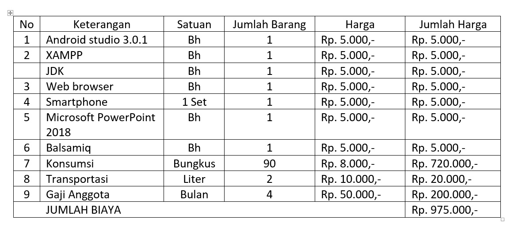

<html>
<body>

<h1> Software Project Management Plan</h1>

<b>Version 1.1 </b> 

2 Februari 2018</b>

 
<b> Aplikasi Pola Hidup Sehat (PAHAT)</b> 

Kelompok 5  
 Arie Fahmi Luthfi 				(1603064) 
 Diky Anwar		(1603065) 
 Shafa dhiyanti			(1603083) 
 Stephan Dwiki Alkine			(1603085)   

<b>Jurusan Teknik Informatika</b> 

<b>Politeknik Negeri Indramayu</b>

<b>2018</b>

</body>
</html>

<h3><b>Bab 1. PENDAHULUAN</b></h3>

<b>1.1 Gambaran Proyek</b>

Proyek ini adalah untuk membuat Aplikasi PAHAT (Aplikasi Pola Hidup Sehat berbasis Mobile). Didalam proyek ini menggunakan bahasa Pemrograman Java. Aplikasi ini dibuat dengan menggunakan software Android Studio. Dibuatnya aplikasi ini bertujuan untuk masyarakat umum yang memang gemar berolahraga dan membantu seberapa jauh dia berjalan dan berapa jauhnya yang diperlukan untuk berolahraga yang bermanfaat untuk kesehatannya dengan dibantu adanya Aplikasi Jalan Sehat ini. Kami juga mengharapkan dengan adanya aplikasi ini bisa berguna bagi kami sendiri khususnya ataupun bagi masyarakat luas pada umumnya.

<b>1.2 Dokumen-dokumen dalam proyek</b>

- SPMP

SPMP (Software Project Management Plan) adalah software yang dibuat untuk mengatur manajemen tugas, waktu pengerjaan dan kerjasama dalam sebuah tim.

- SRS

SRS ( Software Requirements Specification ) adalah dokumen yang menjelaskan tentang berbagai kebutuhan yang harus dipenuhi oleh suatu software. Dokumen ini dibuat oleh developer (pembuat software) setelah menggali informasi dari calon pemakai software.

<b>1.3 Evolusi SPMP</b>

Dokumen ini akan selalu diperbarui seiring dengan kemajuan proyek. Pembaruan harus diharapkan pada bagian berikut :

Referensi diperbarui seperlunya Definisi, akronim, dan singkatan-singkatan seperlunya Proses teknis - bagian ini akan direvisi dengan tepat karena persyaratan dan keputusan disain menjadi lebih jelas Jadwal - saat proyek berjalan, jadwal akan diperbarui sesuai dengan itu

<b>1.4 Material acuan</b>

Dokumen ini adalah dokumen yang digunakan pada tahap perencanaan awal pengerjaan proyek dalam pembuatan kami memakai standar IEEE.
dan dari sumber internet : http://12345irfan.blogspot.co.id/2015/03/dokumen-spmp-image-capture-online.html

<b>1.5 Definisi dan Akronim (singkatan)</b>

| IEEE |	Institute of Electrical and Electronics Engineer |
| BMR | Basal Metabolic Rate |
| SPMP | Software Project Management Plan |
| SRS | Software Requirements Specification |
| GIS | Geographic Informatic System |
| ----------- | --------- | 

<h3><b>Bab 2. ORGANISASI PROYEK</b></h3>

<b>2.1 Model proses</b>

Dalam proyek yang kami buat kita menggunakan model proses Sashimi

<b>2.2 Struktur organisasi</b>

- Project Manager

- Programmer

- Database engineer

- Design Application

- Analysis

<b>2.3 Batasan dan antarmuka organisasi</b>

| From | To | Kaitan |
| ----------- | --------- | ---------- | 
| Manager | Anggota | Dimana manager menjadi pengawas dari anggota-anggotanya bilamana saat anggota lalai dengan tugas-tugasnya manager berhak menegur dan bagi anggota tidak berhak melawan jika ditegur, dan untuk manager sendiri tidak berhak semena-mena dengan jabatanya. |
| Programmer | Analysis | Dikala programmer melakukan kesalahan dalam mengkoding, analisis memiliki tanggung jawab untuk mengecek kesalahan koding-koding yg dilakukan programmer. |
| Analysis | Programmer | Betugas untuk memberi gambaran projek dan alur pengkodingan pada programmer.|
| Design Application | Programmer | Bertugas mendesain tampilan aplikasi yang dapat menarik konsumen saat aplikasi dirilis. |
| Programmer | Database Engineer | Bertugas membuat perancangan sistem database. |

<b>2.4 Lingkup tanggung jawab</b>

Untuk tanggung jawab utama per tahap, lihat bagian 2.2. Seluruh tim proyek bertanggung jawab atas tugasnya masing-masing untuk keberhasilan projek.

Ketua Tim (Manager) : Bertanggung jawab, mengarahkan, mengatur anggota tim atas  projek  yang sedang dibuat

Analisis : Menganalisa atau  mengoreksi fungsi program

Desainer : Membuat kerangka desain projek yang sedang dibuat

Database Engineer : Membuat perancangan sistem database

<h3><b>Bab 3. PROSES MANAJERIAL</b></h3>

<b>3.1 Tujuan dan prioritas manajemen</b>

3.1.1 Tujuan dari proyek ini adalah untuk membuat aplikasi jalan sehat atau joging dengan fitur GIS dan perhitungan BMR. Proyek ini sangat diprioritaskan karena memberi manfaat tinggi bagi tubuh manusia dan untuk membentuk tubuh yang ideal.

<b>3.2 Asumsi-asumsi, ketergantungan/keterkaitan, dan batasan-batasan</b>

3.2.1 Asumsi

Adapun aplikasi yang sejenis jalan sehat atau joging dengan fitur GIS, project yang kami buat ada tambahan fitur perhitungan BMR.

3.2.2 Ketergantungan / Keterkaitan dan Batasan - batasan

Dalam project yang kami buat menggunakan smartphone untuk membuka atau menjalankan aplikasi kami.

<b>3.3 Manajemen resiko</b>

3.3.1 Resiko

- Biaya dan waktu yang tidak sesuai
- Pengembangan sofware yang belum maksimal
- Kegagalan pada komponen-komponen
- Kegagalan kinerja real time
- Kegalan menjalan tugas eksternal

3.3.2 Teknik Manajemen Resiko

- Membuat berapa biaya etimasi
- Menamabah waktu dalam pengerjaan projek
- Menganalisa  waktu project yang akan dibuat
- Evaluasi project yang ditingkatkan
- Membuat metode yang spesifikasi
- Mencari referensi-referensi
- Menganalisis project yang akan di buat
- Prosedur jaminan kualitas
- Membangun kekompakan tim
- Kesungguhan dalam tim
- Analisis teknis

<b>3.4 Mekanisme monitoring dan kontroling</b>

3.4.1 Monitoring

Proses monitoring dilakukan secara tim dan dilaksanakan setiap hari minggu.

3.4.2 Kontroling

Proses kontroling dilakukan oleh manager tim dan dilaksanakan setiap hari jumat agar bisa dievaluasi pada hari terakhir kegiatan

<b>3.5 Perencanaan staff</b>

| Jobdesk     | Nama |
| ----------- | --------- | 
| Project Manager	  | Arie Fahmi Luthfi |
| Programmer          | Stephan Dwiki Alkine |
| Tester              | Shafa Dhiyanti |
| Analisis            | Shafa Dhiyanti |
| Desainer            | Arie Fahmi Luthfi |
| Marketing           | Diky Anwar |

<h3><b>Bab 4. PROSES TEKNIK</b></h3>

<b>4.1 Metode, tool, dan teknik</b>

4.1.1. Metoda

Dalam sebuah perancangan Pola Hidup Sehat berbasis mobile, diperlukan perhatian khusus pada karakteristik penggunan dan keterbatasan device-nya. Pola Hidup Sehat berbasis mobile yang ada tidak begitu saja diaplikasikan. Beberapa aspek yang menjadi perhatian dalam perancangan aplikasi Jalan Sehat berbasis berbasis mobile adalah sebagai berikut:

1) Keterbatasan Resource

Dibanding dengan perangkat desktop yang didukung oleh hardware yang lebih powerfull, perangkat mobile sangat terbatas dalam hal resource. Hal ini menyebabkan penggunaan resource pada proses komputasi mobile harus dilakukan secara efisien dan seefektif mungkin. Keterbatasan resource disini adalah keterbatasan proses komputasi.

2) Keterbatasan Hardware

Keterbatasan hardware yaitu pada pemakaian baterai dan keterbatasan memori. Penghematan baterai pada penggunaan smartphone android dilakukan dengan meminimasi gambar dan animasi. Tampilan lebih banyak menggunakan teks dan button. Tampilan gambar hanya ditampilkan secara sederhana dan seperlunya saja.
Untuk menghemat memori maka aplikasi mengalokasikan memori seoptimal dan seefisien mungkin, sedangkan untuk mengatasi keterbatasan proses komputasi maka perangkat lunak akan melakukan komputasi dan menggunakan thread seminimum mungkin.

3) Keterbatasan Jaringan

Untuk mengurangi penggunaan internet secara terus menerus, maka aplikasi ini harus mampu memberi dukungan opererasi secara offline sehingga tidak harus terhubung secara terus menerus dengan server.

4) Device yang pervasif

Perangkat bergerak memiliki bentuk kecil, mudah dibawa kemana- mana, dan dapat
berpindah tangan sehingga dibutuhkan solusi untuk persoalan sosial maupun pesoalan teknis ini. Diperlukan adanya mekanisme proteksi on-device untuk melindungi data sensitive.

5) Skema integrasi

Banyak aplikasi nirkabel bergerak yang membutuhkan integrasi dengan banyak sistem backend atau middleware berbeda. Saat ini terdapat beberapa teknologi yang dapat digunakan, diantaranya adalah protokol biner proprietary, Framework RPC, messaging serta xml web sercive. Masing - masing teknologi ini memiliki kekurangan dan kelebihan.

6) Kenyamanan pengguna

Merancang aplikasi yang mudah digunakan adalah tantangan besar bagi pengembang.
Beberapa hal yang perlu diperhatikan. Tampilan yang menarik, tidak membosankan, tidak terlalu padat, dan pemanfaatan thread untuk proses yang lama, prefensi pengguna dan penyediaan deployment descriptor untuk kemudahan instalasi.

4.1.2 Tool

1) Laptop

Dalam hal ini keberadaan Laptop digunakan untuk membuat Aplikasi Pola Hidup Sehat, melalui aplikasi Android Studio

2) Handphone Android

Dalam hal ini keberadaan Handphone Android digunakan untuk menguji coba aplikasi apakah sudah bisa digunakan atau tidaknya dari aplikasi Pola Hidup Sehat tersebut

3) Buku Referensi

Buku Referensi digunakan sebagai sumber untuk mencari Sourcode yang diperlukan dalam membuat aplikasi Pola Hidup Sehat, dan sebagai Sumber data dari Proposal yang dibuat

4.1.3 Teknik

4.1.3.1 Teknik Pengumpulan data

Teknik pengumpulan data dalam membuat aplikasi Pola Hidup Sehat berbasis Mobile menggunakan dua macam metode penelitian. Kedua macam metode tersebut meliputi :

1)	Metode Observasi

Metode observasi dilakukan untuk kegiatan analisis kebutuhan pada penelitian pendahuluan. Metode ini digunakan untuk mengetahui kebutuhan masyarakat akan aplikasi yang kami buat.

2)	Metode Tes

Metode tes digunakan untuk mengetahui tingkat efektivitas produk yang dihasilkan berupa media Pola Hidup Sehat berbasis Mobile, apabila nanti sudah ada aplikasinya akan digunakan atau tidaknya.

4.1.3.2 Teknik Analisis data

Data hasil penelitian diperoleh dari diskusi bersama satu kelompok, dengan cara mengetahui terlebih dahulu apa yang saat ini masyarakat butuhkan. Dengan cara itu maka diambil kesepakatan untuk membuat aplikasi Pola Hidup Sehat berbasis Mobile

<b>4.2 Dokumentasi perangkat lunak</b>

1) Sistem Operasi

Sistem operasi yang digunakan adalah Windows

2) Bahasa Pemrograman

Bahasa Pemrograman yang digunakan untuk membuat aplikasi Pola Hidup sehat berbasis Mobile ini menggunakan bahasa pemrograman Java

3) Program Aplikasi

Aplikasi yang digunakan untuk membuat aplikasi ini yaitu menggunakan Android Studio

<b>4.3 Fungsi-fungsi pendukung proyek</b>

1) Fungsi Rutin

Yaitu fungsi adaministrasi yang membutuhkan banyak pemikiran mencakup pembuatan proposal, serta pembuatan Logbook dll.

2) Fungsi Teknis

Yaitu fungsi yang membutuhkan pendapat, dan keputusan bersama agar pembuatan aplikasi berjalan dengan baik

3) Fungsi Analisis

Yaitu fungsi yang membutuhkan pemikiran yang kritis dan kreatif disertai kemampuan untuk mengambil keputusan, seperti menganalisis Proposal, Laporan, maupun membuat keputusan

4) Fungi Interpersonal

Yaitu fungsi yang membutuhkan penilaian dan analisis sebagai dasar pengambilan keputusan serta keterampilan yang berhubungan dengan orang lain, sebagai contohnya dia tahu tugasnya sebagai apa dan bisa menempatkan dirinya dengan tugasnya tersebut

5) Fungsi Leader-Manajerial

Yaitu fungsi yang dimiliki oleh seorang Manajer Proyek, dalam hal ini diperlukan adanya ketegasan dari seorang pemimpin tersebut dalam memimpin kelompoknya. Hal ini dimaksudkan agar adanya kerjasama dalam  membuat aplikasi Pola Hidup Sehat berbasis Mobile

<h3><b>Bab 5. PAKET PEKERJAAN, JADWAL, dan BUDGET</b></h3>

<b>5.1 Paket pekerjaan</b>

| No | Nama | Jabatan | Modul |
| ----------- | --------- | ---------- | ---------- |
| 1 | Arie Fahmi Luthfi | Project Manager & Design application | Logo, Layout Android |
| 2 | Diky Anwar | Database Engineer | Database, Maps |
| 3 | Shafa Dhiyanti | Analysis | Perhitungan BMR, Kalori |
| 4 | Stephan Dwiki Alkine | Programmer | Login gmail/facebook |

<b>5.2 Ketergantungan/keterkaitan</b>

Dalam pengerjaan projek ini keterkaitan dari tugas masing-masing saling menopang agar terbentuknya ketelitian saat pengerjaan dan mendapat hasil akhir yang maksimal

| From | To | Kaitan |
| ----------- | --------- | ---------- | 
| Manager | Anggota | Dimana manager menjadi pengawas dari anggota-anggotanya bilamana saat anggota lalai dengan tugas-tugasnya manager berhak menegur dan bagi anggota tidak berhak melawan jika ditegur, dan untuk manager sendiri tidak berhak semena-mena dengan jabatanya. |
| Programmer | Analysis | Dikala programmer melakukan kesalahan dalam mengkoding, analisis memiliki tanggung jawab untuk mengecek kesalahan koding-koding yg dilakukan programmer. |
| Analysis | Programmer | Betugas untuk memberi gambaran projek dan alur pengkodingan pada programmer.|
| Design | Programmer | Bertugas mendesain tampilan aplikasi yang dapat menarik konsumen saat aplikasi dirilis. |
| Programmer | Database Engineer | Bertugas membuat perancangan sistem database. |

<b>5.3 Kebutuhan-kebutuhan sumber daya</b>

| Sumber Daya | Jenis Kebutuhan | Alasan |
| ----------- | --------- | ---------- | 
| Sumber Daya Manusia | 4 Orang anggota pekerja projek | Mengajukan jumlah tersebut dikarenakan agar keseimbangan antara pengerjaan projek, dokumen-dokumen dan pencarian masukan dari pasar, dengan demikian kita dapat mempercepat proses pekerjaan projek. |
| Sumber Daya Software | Android Studio | Pengajuan software android studio dikarenakan pengerjaan projek menggunakan bahasa pemrograman Java dan agar pengerjaan jauh lebih efisien. |
| | Firebase | Menggunakan software ini di gunakan untuk pembuatan database untuk mengaktifkan projeknya. |
| | JDK dan plugin-pluginnya | Digunakan untuk pembuatan sistem capturing images. |
| Sumber Daya Hardware | Perangkat Komputer | Perangkat induk yang di gunakan dalam pengerjaan projek. |
| | Mobile | Perangkat yang digunakan untuk uji coba aplikasi. |

<b>5.4 Alokasi budget dan sumber daya</b>

Berikut adalah rincian biaya yang diperlukan untuk penggarapan proyek antara lain :

<b>5.5 Jadwal</b>

